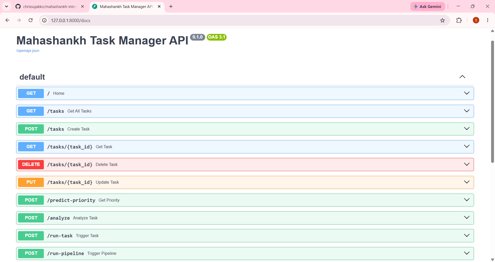

# Mahashankh Internship - AIML Engineering

A complete AI-powered Task Manager built during my internship at Mahashankh Design and Technology.

## Projects Completed

### Project 1 - Core AIML Framework ✅
- Full CRUD Task Manager API
- SQLite Database with SQLAlchemy
- AI Priority Prediction (Machine Learning)
- AI Sentiment Analysis

### Project 2 - Task Orchestration Hub ✅
- Background Task Runner
- Retry Logic on failure
- Pipeline (chain tasks together)
- Task Logging & Monitoring

### Project 3 - Analytics Dashboard ✅
- Live task statistics
- AI-powered priority breakdown
- Completion rate tracking
- AI insights and recommendations

### Capstone - Smart Task Processor ✅
- Combines AI analysis, pipeline processing, and intelligent recommendations
- Single endpoint that demonstrates full system integration
- Real-time priority and sentiment-based decision making

## Tech Stack
- Python 3.13, FastAPI, SQLAlchemy, SQLite
- Scikit-learn (AI/ML)
- APScheduler, BackgroundTasks
- Git & GitHub

## API Endpoints (13 total)
- GET / — Home
- GET/POST /tasks — Task CRUD
- PUT/DELETE /tasks/{id} — Update/Delete
- POST /predict-priority — AI Priority
- POST /analyze — AI Sentiment
- POST /run-task — Background Task
- POST /run-pipeline — Pipeline
- GET /analytics — Statistics
- GET /analytics/summary — AI Insights
- POST /capstone/smart-process — AI-Powered Smart Processing

## Developer
**Sujakko Chakma**
AIML Engineering Intern
Mahashankh Design and Technology
